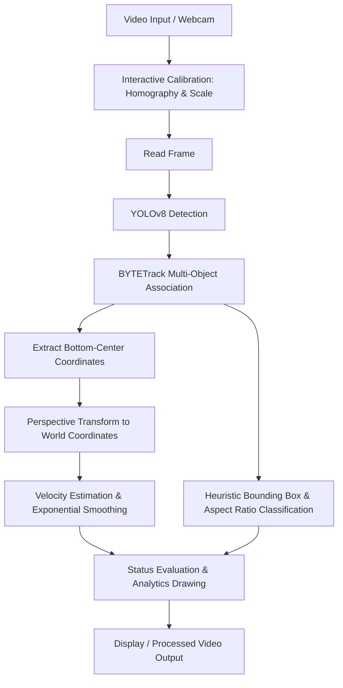

# Real-Time Vehicle Speed Estimation & Traffic Analytics

A computer vision pipeline that processes traffic video feeds to track vehicles, estimate their real-world speeds using perspective homography calibration, and classify them into categories using geometric heuristics.

---

## Project Overview

This project is a localized traffic analytics system developed as an internship project. It takes video feeds (file or camera input) and performs real-time vehicle monitoring. By integrating object detection, tracking, and planar homography, the system extracts traffic parameters—such as vehicle type, velocity, and speed limit violations—without requiring expensive radar hardware.

---

## Motivation

Traditional speed detection systems rely on expensive RADAR or LiDAR sensors. This project explores the feasibility of using standard monocular traffic cameras to estimate vehicle speeds. The project was developed during an internship to study how perspective distortion can be mathematically corrected using homography matrices, allowing 2D image coordinates to map onto a 1D/2D representation of physical road space.

---

## Features

* **Vehicle Detection:** Utilizes a pre-trained **YOLOv8** model to detect cars, buses, and trucks.
* **Multi-Object Tracking:** Integrates **BYTETrack** to associate detections across frames and maintain persistent identities (`tracker_id`).
* **Perspective Calibration:** An interactive 4-point calibration tool maps the skewed road perspective into a normalized top-down space.
* **Speed Estimation:** Calculates displacement over a sliding window of historical tracking coordinates and smooths velocity curves.
* **Heuristic Type Classification:** Classifies vehicles into sub-types (`sedan`, `suv`, `hatchback`, `bus`, `truck`) by combining YOLOv8 classes with aspect ratio and bounding box area criteria.
* **Telemetry Visualization:** Overlays bounding boxes, speeds, and color-coded statuses (Normal, Warning, Speeding Violation) dynamically.
* **Traffic Statistics Dashboard:** Displays real-time counts and speed violations categorized by vehicle type.

---

## System Pipeline



---

## Technical Approach

### 1. Planar Homography (Perspective Transformation)
Cameras capture three-dimensional scenes on a two-dimensional sensor, introducing perspective distortion (objects farther away appear smaller and move fewer pixels per frame). To compute speed, pixel movement must be converted to physical meters.
* The user defines a quadrilateral ground plane ($SOURCE$).
* The system computes a perspective transform matrix $M$ using:
  $$M = \text{cv2.getPerspectiveTransform}(SOURCE, TARGET)$$
* Coordinates are mapped onto a target coordinate system, allowing linear distance measurements.

### 2. Scale Calibration
To convert target units to physical meters, the user selects a reference distance in the scene (such as a vehicle of known length, e.g., 4.5m). This scale factor is used as the pixel-to-meter ratio:
$$\text{Scale Ratio} = \frac{\text{Distance in Target Plane}}{\text{Physical Distance (meters)}}$$

### 3. Velocity Calculation & Smoothing
* Speed is computed by taking the Euclidean distance between the first and last position in a 10-frame sliding window (approx. 0.33 seconds at 30 FPS).
* To combat bounding box detection jitter, an Exponential Moving Average (EMA) is applied:
  $$\text{Speed}_{\text{stable}} = \alpha \cdot \text{Speed}_{\text{raw}} + (1 - \alpha) \cdot \text{Speed}_{\text{stable\_prev}}$$
  where $\alpha = 0.3$.

---

## Project Structure

```
├── README.md                 # Project documentation
├── main.py                   # Main pipeline script
├── PRESENTATION.pdf          # Internship summary presentation
├── REQUIREMENTS/             # Model weights and datasets
│   ├── yolov8s.pt            # Pre-trained YOLOv8 weights
│   └── vehicle-type-image-dataset.zip
├── TEST VIDEOS/              # Sample test inputs
└── SAMPLE OUTPUTS/           # Processed demonstration files
```

---

## Setup

### Prerequisites
* Python 3.8 or higher
* Recommended: Virtual Environment (venv)

### Installation
Clone the repository and install dependencies:
```bash
pip install ultralytics supervision opencv-python numpy
```
*Note: This project does not require TensorFlow or PyTorch-GPU to run.*

---

## Usage

1. Run the main script:
   ```bash
   python main.py
   ```
2. Select your input type:
   * Enter `1` for default Webcam.
   * Enter `2` for a video file, and specify its path (e.g., `TEST VIDEOS/carsm.mp4`).
3. **Calibrate Perspective:**
   * An image window will open. Click exactly **4 points** in clockwise order (Top-Left $\to$ Top-Right $\to$ Bottom-Right $\to$ Bottom-Left) outlining the road plane.
4. **Calibrate Scale:**
   * Click **2 points** (e.g., front and rear of a car) representing a known physical reference distance of **4.5 meters**.
5. The tracking window will open. Press `q` to exit the stream at any time.

---

## Current Limitations

During interviews, these known limits are fully acknowledged as design trade-offs:
* **Planar Assumption:** Perspective homography assumes all tracked points lie on a flat 2D plane ($Z = 0$). Any altitude variations or changes in vehicle elevation degrade accuracy.
* **Anisotropic Scaling:** The calibration maps coordinates to an arbitrary target plane. If the real-world geometry of the calibration area is a narrow rectangle but mapped to a square target, speed calculations will vary depending on the direction of travel.
* **Anchor Parallax:** Tracking uses the bottom-center of the bounding box. Since the bounding box size changes depending on vehicle perspective (approaching vs. receding), this introducing minor drift.
* **Manual Calibration:** The system requires manual initialization and cannot run headlessly without pre-saved calibration parameters.

---

## Future Improvements

* **Persistence of Calibration:** Save calibration matrices to a YAML configuration file to run without interactive mouse input.
* **Directional Calibration:** Adjust target coordinate coordinates to match actual physical lane dimensions, preventing anisotropic distortion.
* **Dynamic Scale Adaptation:** Auto-calibrate scale using road lane markings (standard lengths) rather than manual clicks.
* **Deep Learning Classification Integration:** Integrate a lightweight classification model (e.g., MobileNet or YOLOv8-cls) run via ONNX Runtime to perform inference on bounding box crops, replacing rule-based heuristics.

---

## Technologies Used

* **OpenCV:** Drawing, mouse interaction, homography estimation, video I/O.
* **Ultralytics YOLOv8:** Object detection.
* **Supervision (Roboflow):** BYTETrack tracker orchestration and coordinates extraction.
* **NumPy:** Matrix operations and Euclidean distance calculations.

---

## Learning Outcomes

* Developed practical understanding of **planar perspective geometry** and homography matrices in computer vision.
* Gained experience using state-of-the-art detector frameworks (**YOLOv8**) and tracker algorithms (**BYTETrack**).
* Explored tradeoffs between lightweight **rule-based heuristics** and heavy deep learning architectures for edge inference latency constraints.
* Practiced building interactive OpenCV dashboards for data visualization and analytics.
